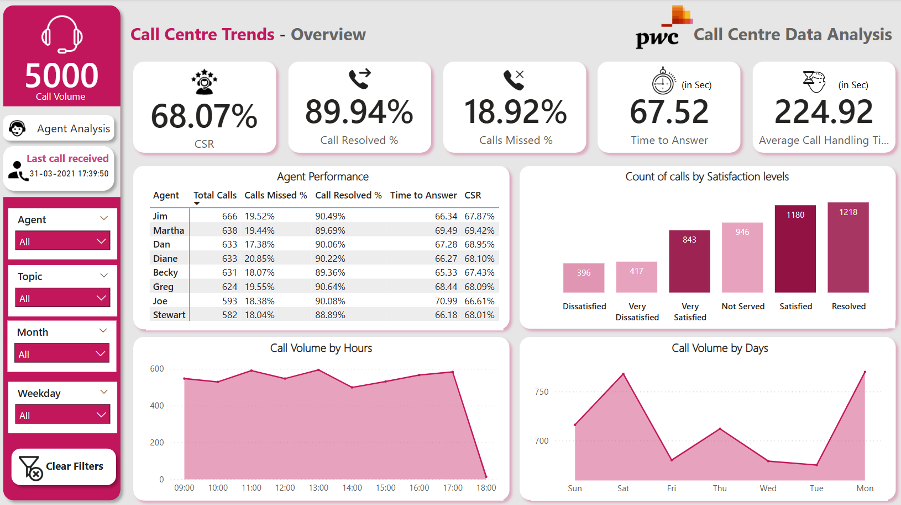

# 📞 Call Centre Performance Analysis – Power BI Report

This project is a comprehensive Power BI dashboard that visualizes and analyzes key performance metrics of a call center. The report helps stakeholders monitor agent efficiency, customer satisfaction, and operational performance through dynamic and interactive visualizations.

## 📊 Overview

The **Call Centre Performance Analysis** report provides insights into:
- Call volume trends
- Average call handling time
- Agent-wise performance metrics
- Customer satisfaction levels
- Service level agreement (SLA) adherence
- Call resolution rates

## 🎯 Objective

The main goal of this project is to enable data-driven decision-making by visualizing core call center KPIs, helping improve agent performance, reduce call handling times, and enhance customer service quality.

## ⚙️ Tools Used

- **Power BI Desktop** – for data modeling and report visualization
- **Microsoft Excel** – as a data source

## 🧩 Features

- Interactive filters for agents, time periods, and call categories
- KPI cards to track average handling time, first call resolution, and more
- Trend analysis with line and bar charts
- Drill-down capability for detailed agent performance

## 🚀 How to Use

1. Clone or download this repository.
2. Open the `.pbix` file using **Power BI Desktop**.
3. Interact with the dashboard using slicers and filters to explore insights.

## 🖼️ Preview

